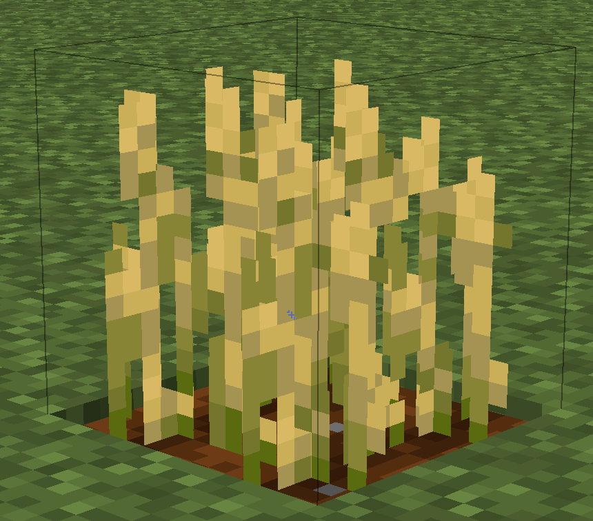

# CropHitbox

Simple minecraft mod which changes hitbox of crops and nether wart to 1.12 size

## Installation

* Download latest version from [release page](https://github.com/SpikedPaladin/CropHitbox/releases)
* Move downloaded .jar file to minecraft mods folder
	* For windows
		* Press Win+R > type %appdata%\.minecraft\mods > press Ok. 
	* For linux
		* In your file manager navigat to ~/.minecraft/mods
	* For OS X
		* Open Finder then paste: ~/Library/Application Support/minecraft/mods in the Search box.
* Run minecraft
* Enjoy

## Building

1. Download or clone this repository
2. Open it as a Project in IntelliJ
3. Let it configure.
4. Run the gradle task `setupDecompWorkspace`
5. Reload gradle project.
6. Build with task `build`, result file located in `build/libs` folder
